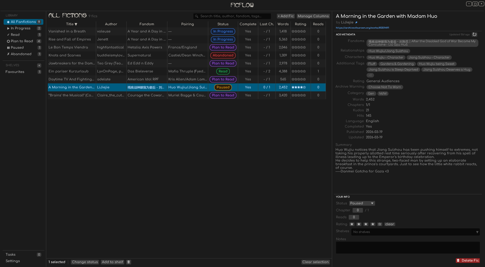

# Ficflow

Ficflow is a software designed to help you track your fanfiction reading list and organize them the way you want.



## Why Ficflow?

I felt like there was a lack of ways to manage my AO3 reading list (other than having hundreds of tabs opened on my phone or saving the links in my notes), so I decided to work on a solution! It's also my first time making a project in Rust, so if you have any criticism about my approach, feel free to open an issue and teach me!

## Installation

Prebuilt binaries for every release are available on the [Releases page](https://github.com/yvesmotteux/Ficflow/releases/latest). Ficflow is a single binary: run it with no arguments to launch the GUI, or pass a subcommand to use the CLI.

> **Heads-up:** Ficflow is developed and tested on Linux. The Windows and macOS builds compile and run, but I haven't been able to exercise them under real-world use. If you hit a bug on either platform, please [open an issue](https://github.com/yvesmotteux/Ficflow/issues) — reports are very welcome.

### Arch Linux (AUR)

```sh
yay -S ficflow-bin
# or with paru
paru -S ficflow-bin
```

### Linux (any distribution — AppImage, recommended)

A portable [AppImage](https://appimage.org) bundle is published with every release. Runs on most desktop Linux distributions (anything newer than mid-2022) without installation:

```sh
curl -L -o Ficflow.AppImage https://github.com/yvesmotteux/Ficflow/releases/latest/download/Ficflow-x86_64.AppImage
chmod +x Ficflow.AppImage
./Ficflow.AppImage
```

### Linux (manual binary install)

If you'd rather drop the raw binary into `/usr/local/bin/` yourself:

```sh
curl -L -o ficflow https://github.com/yvesmotteux/Ficflow/releases/latest/download/ficflow-linux-amd64
chmod +x ficflow
sudo mv ficflow /usr/local/bin/
```

### macOS

Apple Silicon (M1/M2/M3+) only. Intel Macs aren't shipped as prebuilt binaries — build from source if you need Intel.

```sh
curl -L -o ficflow https://github.com/yvesmotteux/Ficflow/releases/latest/download/ficflow-macos-arm64
chmod +x ficflow
sudo mv ficflow /usr/local/bin/
```

The binary is unsigned, so the first launch will be blocked by Gatekeeper. Either right-click the binary in Finder and choose **Open**, or remove the quarantine flag once:

```sh
xattr -d com.apple.quarantine /usr/local/bin/ficflow
```

### Windows

1. Download `ficflow-windows-amd64.exe` from the [Releases page](https://github.com/yvesmotteux/Ficflow/releases/latest).
2. (Optional) Move it to a directory on your `PATH` so you can run it from any terminal.
3. Double-click to launch the GUI, or invoke it from PowerShell / cmd with arguments for the CLI.

SmartScreen may warn the first time; click **More info → Run anyway**.

### Build from source

Requires a stable Rust toolchain (≥ 1.75 recommended).

```sh
git clone https://github.com/yvesmotteux/Ficflow.git
cd Ficflow
cargo build --release
./target/release/ficflow
```

## Features (Planned, the order is approximate)

- [ ] Bump deps and move to edition 2024 or 2025
- [ ] Ability to change column order by grabbing them
- [ ] Ability to choose the text size / zoom level in the settings
- [ ] New feature of auto-shelves (based on ships, fandoms, relationship,...)
- [ ] Possibility to choose the location of the library (defaults to appdata/ ~/.ficflow like now), with persistence of that config
- [ ] Release the software on the AUR (can we make both the CLI and GUI work at the same time?)
- [ ] Import/Export database to create backups
- [ ] Ability to login to access restricted fics
- [ ] Create a rule that automatically checks for updates when the GUI is open and sends notifications to the user in case there is a new one (settings, refresh every x time, + notifications for all manual and auto refreshes when a new update was found! And an inbox too)
- [ ] add works with not only single fics, but collections, a user list of fics, a tag, a user profile,...
- [ ] Add a search system based on tags, with an option to filter out fics already catalogued
- [ ] Setting to make it start in the background on computer start-up, and stay on background when closing (opt-in, different settings or same? SHould add a proper, cleaner "quit" option if so)
- [ ] Create a mobile phone app (target for v2)

## Contributing

Any feedback or contributions are welcome! If you have ideas, suggestions, or improvements, feel free to open an issue or submit a pull request.

